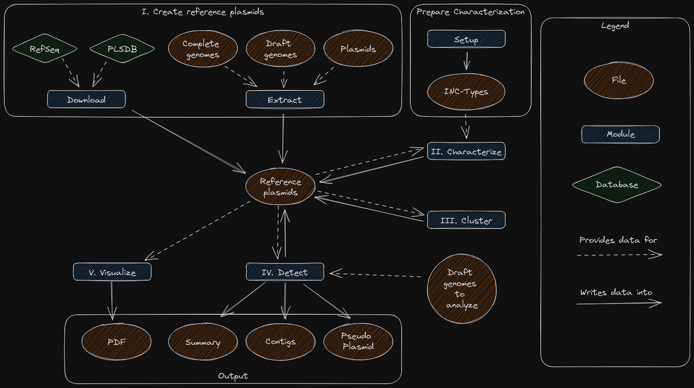

[](https://github.com/oschwengers/tadrep/blob/master/LICENSE)


[](https://pypi.org/project/tadrep)
[](https://bioconda.github.io/recipes/tadrep/README.html)

# TaDReP: Targeted Detection and Reconstruction of Plasmids

TaDReP is a tool for the rapid and targeted detection and reconstruction of plasmids within bacterial draft assemblies.

- [Description](#description)
- [Installation](#installation)
- [Input & Output](#input-and-output)
- [Overview](#overview)
- [Usage](#usage)
  - [Setup](#setup)
  - [Database](#database)
  - [Extract](#extract)
  - [Characterize](#characterize)
  - [Cluster](#cluster)
  - [Detect](#detect)
  - [Visualize](#visualize)
- [Issues & Feature Requests](#issues)

## Description

TaDReP facilitates the rapid screening of target plasmids within single draft genomes or entire cohorts thereof.

It detects and reconstructs reference plasmids within bacterial draft assemblies via Blast+ contig alignments. Contig alignments are rigourously filtered regarding coverage and sequence identity thresholds. Finally, reference plasmids are detected and reconstructed upon strict thresholds regarding plasmid-wise coverage and sequence identity.

## Installation

TaDRep can be installed via Conda and Pip. However, we encourage to use [Conda](https://conda.io/projects/conda/en/latest/user-guide/install/index.html) to automatically install all required 3rd party dependencies.

### Conda

```bash
conda install -c conda-forge -c bioconda tadrep
```

### Pip

```bash
$ python3 -m pip install --user tadrep
```

## Input and Output

### Input

TaDReP accepts bacterial draft genome assemblies in (zipped) fasta format. Complete reference plasmid sequences are either extracted from (semi-)closed genomes or plasmid sequence collections of plasmid sequences (Fasta), or created from public plasmid databases (RefSeq / PLSDB). For information how to extract plasmid sequences, please read the [extract](#extract) section below.

### Output

For each draft genome TaDReP writes a TSV summary file providing all detected reference plasmids and aligned genome contigs. For each reference plasmid that was detected in a draft assembly, ordered and rearranged contigs are exported as `N`-merged scaffolds, as well as mere contigs. Furthermore, for each reconstructed plasmid, the reference plasmid backbone and all contig alignments are visualized in a `PDF` figure.

- `<genome>-summary.tsv`: detailed per contig alignment summary
- `<genome>-<plasmid>-contigs.fna`: ordered and rearranged contigs of the reconstructed plasmid
- `<genome>-<plasmid>-pseudo.fna`: pseudomolecule sequence of the reconstructed plasmid
- `<genome>-<plasmid>.pdf`: visualization of aligned contigs against the detected reference plasmid

If multiple genomes are provided, TaDReP also provides a presence/absence matrix of all detected plasmids as a cohort analyses, as well as a short summary of plasmids and which contigs were matched in each genome.

- `plasmids.info`: plasmid characterization summary
- `plasmids.tsv`: presence/absence table of detected plasmids
- `summary.tsv`: short summary of matched contigs through all genomes
- `tadrep.log`: log-file for debugging

## Overview



## Usage

TaDReP's workflow comprises seven steps implement in CLI submodules to ease semi-automated multi-step analyses.

```
usage: TaDReP [--help] [--verbose] [--threads THREADS] [--tmp-dir TMP_DIR] [--version] [--output OUTPUT] [--prefix PREFIX]  ...

Targeted Detection and Reconstruction of Plasmids

General:
  --help, -h            Show this help message and exit
  --verbose, -v         Print verbose information
  --threads THREADS, -t THREADS
                        Number of threads to use (default = number of available CPUs)
  --tmp-dir TMP_DIR     Temporary directory to store blast hits
  --version             show program's version number and exit

General Input / Output:
  --output OUTPUT, -o OUTPUT
                        Output directory (default = current working directory)
  --prefix PREFIX       Prefix for all output files (default = None)

Submodules:
  
    setup               Download and prepare inc-types
    database            Download and create database for TaDReP
    extract             Extract unique plasmid sequences
    characterize        Identify plasmids with GC content, Inc types, conjugation genes
    cluster             Cluster related plasmids
    detect              Detect and reconstruct plasmids in draft genomes
    visualize           Visualize plasmid coverage of contigs

Citation:
Schwengers et al. (2023)
TaDReP: Targeted Detection and Reconstruction of Plasmids.
GitHub https://github.com/oschwengers/tadrep
```

## Setup

The setup module downloads external databases, *e.g.* PlasmidFinders incompatibility groups that are required to characterize plasmids.

### Example

Verbosely download inc-types:

```bash
tadrep -v -o <output-path> setup
```

## Database

The TaDReP database module downloads public plasmid databases (PLSDB / RefSeq) into a reference plasmid file. This creates a subdirectory in a user specified output directory.

If you downloaded a database, you can skip the extract step and start with the [characterization](#characterize).

```bash
usage: TaDReP database [-h] [--type {refseq,plsdb}] [--force]

options:
  -h, --help            show this help message and exit

Input / Output:
  --type {refseq,plsdb}
                        External DB to import (default = 'refseq')
  --force, -f           Force download and new setup of database
```

### Examples

Create refseq database:

```bash
tadrep -v -o <output-path> database --type refseq
```

Create PLSDB database:

```bash
tadrep -v -o <output-path> database --type plsdb
```

Overwrite existing refseq files with newly downloaded data.

```bash
tadrep -v -o <output-path> database --type refseq -f
```

## Extract

Extracts reference plasmid sequences from complete genomes, (semi-)draft genomes or plasmid files.

```bash
usage: TaDReP extract [-h] [--type {genome,plasmid,draft}] [--header HEADER] [--files FILES [FILES ...]] [--discard-longest DISCARD_LONGEST] [--max-length MAX_LENGTH]

options:
  -h, --help            show this help message and exit

Input:
  --type {genome,plasmid,draft}, -t {genome,plasmid,draft}
                        Type of input files
  --header HEADER       Template for header description inside input files: e.g.: header: ">pl1234" --> --header "pl"
  --files FILES [FILES ...], -f FILES [FILES ...]
                        File path
  --discard-longest DISCARD_LONGEST, -d DISCARD_LONGEST
                        Discard n longest sequences in output
  --max-length MAX_LENGTH, -m MAX_LENGTH
                        Max sequence length (default = 1000000 bp)
```

For different input types specified via `--type`:

- `genome`: extract all but the longest sequence. This can be adjusted via `--discard-longest`.
- `draft`: extracts only sequences with specific headers. Headers can be specified via `--header`.
- `plasmid`: extracts all sequences from a given file without any filtering.

If you extracted references, you can skip the database step and start with the [characterization](#characterize).

### Examples

Extract all sequences from file `plasmids.fna` ignoring the two longest:

```bash
tadrep -v --type genome --discard-longest 2 --files plasmids.fna
```

Extract all sequences from file `plasmids.fna` where `header` contains `pl`:

```bash
tadrep -v --type draft --header "pl" --files plasmids.fna
```

Extract all potential plasmid sequences (one of 'plasmid', 'complete', 'circular=true' in header) from file `plasmids.fna` ignoring sequences longer than 500000 bp:

```bash
tadrep -v --type draft --max-length 500000 --files plasmids.fna
```

Extract all sequences from file `plasmids.fna`:

```bash
tadrep -v --type plasmid --files plasmids.fna
```

## Characterize

All reference plasmids are characterized by following features:

- Length
- GC content
- Incompatibility types
- Coding sequences

If you downloaded a reference database this is the step to start with.

```bash
usage: TaDReP characterize [-h] [--db DATABASE] [--inc-types INC_TYPES]

optional arguments:
  -h, --help            show this help message and exit

Input:
  --db DATABASE         Import json file from a given database path into working directory
  --inc-types INC_TYPES
                        Import inc-types from given path into working directory
```

### Examples

Characterize plasmids in working directory `<output-path>` and import inc-types from `inc-types` folder:

```bash
tadrep -v -o <output-path> characterize --inc-types inc-types/inc-types.fasta
```

If inc-types is already present inside the working directory, the parameter `--inc-types` can be omitted:

```bash
tadrep -v -o <output-path> characterize
```

If you downloaded a database you can import it into the working directory `<output-path>` with the `--db` parameter:

```bash
tadrep -v -o <output-path> characterize --db databases/plsdb/plsdb.json --inc-types inc-types/inc-types.fasta
```

## Cluster

The cluster step/module groups plasmids with similar sequences and features.

```bash
usage: TaDReP cluster [-h] [--min-sequence-identity [1-100]] [--max-sequence-length-difference [1-1000000]] [--skip]

options:
  -h, --help            show this help message and exit

Parameter:
  --min-sequence-identity [1-100]
                        Minimal plasmid sequence identity (default = 90%)
  --max-sequence-length-difference [1-1000000]
                        Maximal plasmid sequence length difference in basepairs (default = 1000)
  --skip, -s            Skips clustering, one group for each plasmid
```

### Example

```bash
tadrep -v cluster
```

## Detect

The detection aligns contigs of bacterial draft genomes to reference plasmids using BLAST+. Each match is evaluated by coverage and sequence identity of the aligned plasmid section and can be individualy adjusted by using `--min-plasmid-identity` and `--min-plasmid-coverage`. If various contigs match a plasmid and the combined coverage and identity exceed a certain threshold, the combination of aligned contigs is saved.

Each detected plasmid is reconstructed as a pseudo sequence, where matching contigs are linked by a sequence of `N`. Information on detected & reconstructed plasmids and in which draft genomes they were found in provided in a summary and a presence-absence table.

```bash
usage: TaDReP detect [-h] [--genome GENOME [GENOME ...]] [--min-contig-coverage [1-100]] [--min-contig-identity [1-100]] [--min-plasmid-coverage [1-100]] [--min-plasmid-identity [1-100]]
                     [--gap-sequence-length GAP_SEQUENCE_LENGTH]

optional arguments:
  -h, --help            show this help message and exit

Input / Output:
  --genome GENOME [GENOME ...], -g GENOME [GENOME ...]
                        Draft genome path

Annotation:
  --min-contig-coverage [1-100]
                        Minimal contig coverage (default = 90%)
  --min-contig-identity [1-100]
                        Maximal contig identity (default = 90%)
  --min-plasmid-coverage [1-100]
                        Minimal plasmid coverage (default = 80%)
  --min-plasmid-identity [1-100]
                        Minimal plasmid identity (default = 90%)
  --gap-sequence-length GAP_SEQUENCE_LENGTH
                        Gap sequence N length (default = 10)
```

### Examples

Detect reference plasmids from directory `<output-path>` in file `draft.fna` with default settings:

```bash
tadrep -v -o <output-path> detect --genome draft.fna
```

Detect reference plasmids from directory `<output-path>` in file `draft.fna`;

`75%` of `contig length` has to be covered by a match;

 `Combined contig matches` have to cover at least `95%` of `reference plasmid` length:

```bash
tadrep -v -o <output-path> detect --genome draft.fna --min-contig-coverage 75 --min-plasmid-coverage 95
```

Detect reference plasmids from directory `<output-path>` in file `draft.fna`;

`Contig sequence` of a match has to be at least `80%` identical to reference plasmid;

`Combined contig matches` have to sum up to at least `95%` identity of `reference plasmid` sequence:

```bash
tadrep -v -o <output-path> detect --genome draft.fna --min-contig-identity 80 --min-plasmid-identity 95
```

Note: `--min-contig-coverage` / `--min-plasmid-identity` and `--min-contig-identity` / `--min-plasmid-coverage` can be combined as well.

## Visualize

Visualizes matching contigs from draft genomes for each detected plasmid.

By default, contigs are represented by boxes, either on top or bottom of the plasmid center line. The position of the boxes represents a match on either forward or backward strand respectively. A colour gradient is used to indicate the identity between contig and plasmid section, a brighter colorization implies smaller sequence identity. The start of this gradient, where it is the brightest, can be individually set with the `--interval-start` parameter.

```bash
usage: TaDReP visualize [-h] [--plotstyle {bigarrow,arrow,bigbox,box,bigrbox,rbox}] [--labelcolor LABELCOLOR] [--linewidth LINEWIDTH] [--arrow-shaft-ratio ARROW_SHAFT_RATIO] [--size-ratio SIZE_RATIO]
                        [--labelsize LABELSIZE] [--labelrotation LABELROTATION] [--labelhpos {left,center,right}] [--labelha {left,center,right}] [--interval-start [0-100]] [--number-of-intervals [1-100]]
                        [--omit_ratio [0-100]]

optional arguments:
  -h, --help            show this help message and exit

Style:
  --plotstyle {bigarrow,arrow,bigbox,box,bigrbox,rbox}
                        Contig representation in plot
  --labelcolor LABELCOLOR
                        Contig label color
  --linewidth LINEWIDTH
                        Contig edge linewidth
  --arrow-shaft-ratio ARROW_SHAFT_RATIO
                        Size ratio between arrow head and shaft
  --size-ratio SIZE_RATIO
                        Contig size ratio to track

Label:
  --labelsize LABELSIZE
                        Contig label size
  --labelrotation LABELROTATION
                        Contig label rotation
  --labelhpos {left,center,right}
                        Contig label horizontal position
  --labelha {left,center,right}
                        Contig label horizontal alignment

Gradient:
  --interval-start [0-100]
                        Percentage where gradient should stop
  --number-of-intervals [1-100]
                        Number of gradient intervals

Omit:
  --omit_ratio [0-100]  Omit contigs shorter than X percent of plasmid length from plot
```

### Examples

Visualize results from detection in directory `<output-path>` with default settings:

```bash
tadrep -v -o <output-path> visualize
```

Visualize results from detection in directory `sho<output-path>wcase`;

`Brightest colour` of gradient starts at `95.5%` sequence identity (darkest colour is always 100% identity);

`Surround` contig blocks with `1px` line:

```bash
tadrep -v -o <output-path> visualize --interval-start 95.5 --linewidth 1
```

## Issues & Feature Requests

TaDReP is brand new and like in every software, expect some bugs lurking around. So, if you run into any issues with TaDReP, we'd be happy to hear about it.
Therefore, please, execute it in verbose mode (`-v`) and do not hesitate to file an issue including as much information as possible:

- a detailed description of the issue
- command line output
- log file (`tadrep.log`)
- a reproducible example of the issue with an input file that you can share _if possible_
